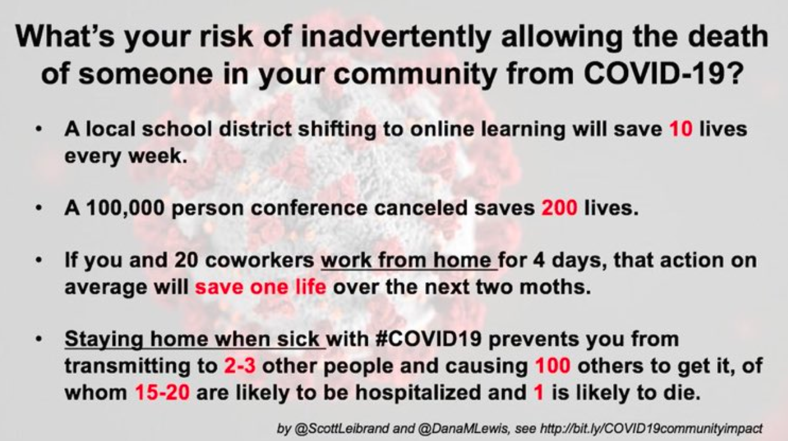
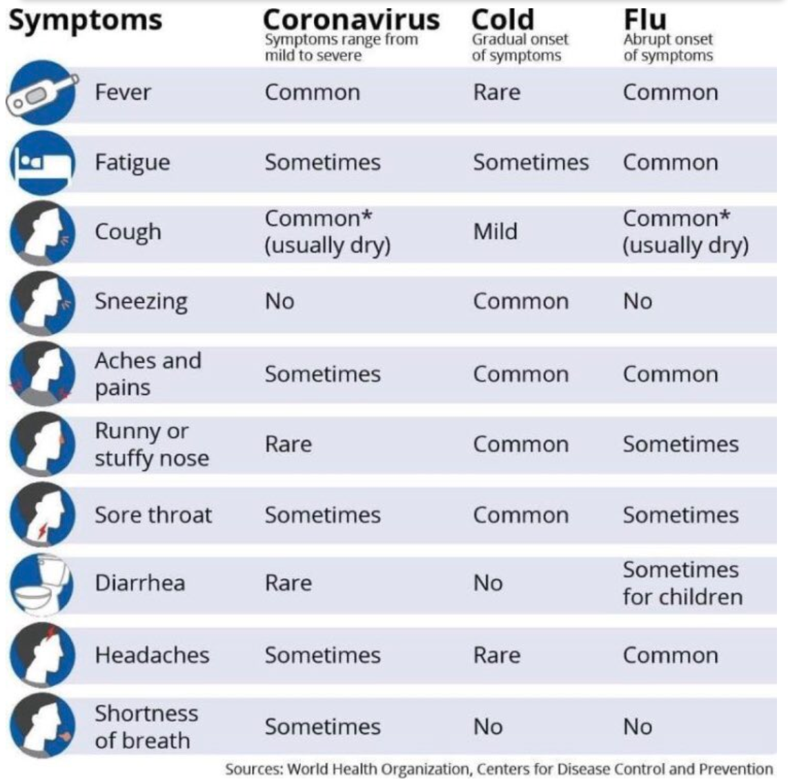

# Koronavírus (COVID-19) 

## Aktualizácia a odporúčania 

### Zostavila [Julie McMurry, MPH] (https://twitter.com/flattencurve) 

#### Aktualizované {{site.data.last_updated [site.active_lang]}} 

Keď to uznáte za vhodné, tak tento text zdieľajte. URL: [www.flattenthecurve.com](https://www.flattenthecurve.com), [facebook](https://www.facebook.com/photo.php?fbid=10158003174454431&set=a.10150142889684431&type=3&theater), alebo cez [twitter](https://twitter.com/figgyjam/status/1236346020855861248). Text sa v čase mení. Rýchlosť je kľúčová, takže dobrý plán teraz je lepší ako dokonalý plán neskôr. Ak chcete pomôcť s prekladom, kontaktujte nás cez [kontaktnú stránku](/contact/). V súčasnosti prebieha preklad do taliančiny, francúzštiny, nemčiny a španielčiny.

**Aktualizácia**: Máme newsletter. [Prihláste sa](https://flattenthecurve.substack.com/) ak chete aktualizácie. Žiadny spam, marketing, atď.

**Ak chete pomôcť s obsahom, kliknite [sem](https://www.flattenthecurve.com/#how-to-help-and-contribute), alebo nás prosím, [kontaktujte tu](/contact/).**

Všetky odkazy na pôvodné zdroje sú poskytnuté ako referencie a aby bol známy ich autor.

# Áno, je to zlé

Nepanikárte, ale netvárte sa, že sa Vás varovania o novom Koronavíruse netýkajú. Konsenzus je, že zabráneniu šírenia bolo možné pred niekoľkými týždňami, avšak v tejto chvíli to už [nie je reálne](https://twitter.com/uwmnewsroom/status/1236020906956189696). Aj keď nám Čína [kúpila čas, premrhali sme ho](https://twitter.com/florian_krammer/status/1236344865924972545). V tejto chvíli sme vo [fáze pandémie, ktorá bude nasledovaná sezónnymi recidívami choroby](https://twitter.com/NAChristakis/status/1235983934187544578) až do chvíle, kým nebude dostupné očkovanie (ak budeme mať šťastie, tak za [18-24 mesiacov](https://www.politico.com/news/2020/03/05/coronavirus-trump-vaccine-rhetoric-121796?nname=playbook&nid=0000014f-1646-d88f-a1cf-5f46b7bd0000&nrid=0000014e-f0fe-dd93-ad7f-f8ff7e290000&nlid=630318)).

# Toto nie je bežná chrípka ani v tom najlepšom prípade

Predbežný odhad Svetovej Zdravotníckej Organizácie o smrtnosti na úrovni 3.5% je priemerom naprieč všetkými vekovými skupinami a poskytli množstvo prehľadových dát ako dôkaz o veľkom počte asymptomatických prípadov. Existuje veľmi silný konsenzus, že ľudia nad 60 rokov a ľudia s už existujúcimi zdravotnými komplikáciami sú zasiahnutí najviac.

Spočiatku ešte existovala nádej že tých 3.5% je prudko nadhodnotených, no čím viac údajov pribúda, tým viac sa [ukazuje že to tak nie je](https://www.statnews.com/2020/02/25/new-data-from-china-buttress-fears-about-high-coronavirus-fatality-rate-who-expert-says/).
Čísla z Južnej Kórey sú zatiaľ z celého sveta najoptimistickejšie ([0.7% prípadov bolo smrteľných](https://twitter.com/marcelsalathe/status/1236914078632812544)), avšak, a) obyvateľstvo Južnej Kórey je v priemere mladšie a b) Južná Kórea (na rozdiel od väčšiny ostatných krajín) robila
hneď od prvých prípadov všetko správne: veľmi skoro začali s hromadným testovaním v spojení s radikálnou otvorenosťou, podporou verejnosti a [brilantné drive-through testovanie](https://twitter.com/cnni/status/1234524871226482688)! Ak je tento kmeň nového Koronavírusu podobný iným vírusom, agresívne opatrenia na obmedzenie jeho prenosu môžu zároveň znížiť priemernú vírusovú nálož (počet vírusových čiastočiek, ktoré sú potrebné na ochorenie). Toto môže znížiť priemernú závažnosť ochorenia a znížiť aj celkovú úmrtnosť. To však ukáže až čas.

Navyše, AK je smrtnosť vírusu na úrovni čo i len 1% ([ako na lodi Diamond Princess](https://wwwnc.cdc.gov/eid/article/26/6/20-0452_article)), tak je aj tak [10 kráť vyššia ako typická sezónna chrípka](https://www.bloomberg.com/opinion/articles/2020-03-05/how-bad-is-the-coronavirus-let-s-compare-with-sars-ebola-flu).

![The 61,099 flu-related deaths in the U.S. during the severe flu season of 2017-2018 amounted to 0.14% of the estimated 44.8 million cases of influenza-like illness. There were also an estimated flu-related 808,129 hospitalizations, for a rate of 1.8%. Assume a Covid-19 outbreak of similar size in the U.S., multiply the death and hospitalization estimates by five or 10, and you get some really scary numbers: 300,000 to 600,000 deaths, and [4 million to 8 million hospitalizations in a country that has 924,107 staffed hospital beds](https://www.bloomberg.com/opinion/articles/2020-03-05/how-bad-is-the-coronavirus-let-s-compare-with-sars-ebola-flu) \[for all illnesses combined\].](images/en/covid-flu-comparison.png)

Vo väčšine prípadov má infekcia mierny priebeh, avšak stále je prenosná. Tí, u ktorých je priebeh komplikovaní sú zasiahnutí ozaj tvrdo. Smrtnosť nie je úplný obraz; Talianski lekári uvádzajú, že 10% prípadov nepotrebuje len hospitalizáciu, ale aj intenzívnu starostlivosť - a tú potrebujú po dobu 3 až 6 týždňov. Toto nie je udržateľné.

# Neodbáčajme od témy

Dosť sa špekuluje o "ozajstnej" miere; stále sme však v počiatočnej fáze pandémie a presné určenie smrtnosti môže trvať roky. AVŠAK už teraz vieme, že je to niekde **medzi 0.5% až 4%. Tento rozsah je však viac ako primeraným dôkazom, ktorý oprávňuje okamžité, tvrdé a rozsiahle preventívne opatrenia.** Najdôležitejšou vecou ktorá sa teraz musí urobiť je, že zrovnáme krivku epidémie, aby sme zdravotnému systému dali priestor na zvládanie existujúcich prípadov a aby mali vedci dostatočný čas na výskum a vývoj vakcíny a liečby.

!(obrazok)

# Je to tu

Predpokladajme, že vírus už je vo Vašom meste / robote / kostole / atď. [S veľkou pravdepodobnosťou to tak je akurát to kvôli nedostatku testovania ešte nebolo zistené](https://twitter.com/balajis/status/1234879748083503105). Odhady z Talianska sú také, že na začiatku epidémie bol počet skutočných infekcíí [štvornásobný ako potvrdený počet prípadov.](https://twitter.com/AdamJKucharski/status/1236004937529798659). V Seattle, kryptycký prenos v komunite prebiehal [týždne pred tým ako sa to zistilo](https://twitter.com/trvrb/status/1236096904678633472). Seattle a Stanford robia kus poctivej roboty svojimi vlastnými testovacími sadami; [Okolo 5-7% testov v Seattle má pozitívny výsledok](https://twitter.com/UWVirology/status/1236017803162873856) a testovať sa môže ktokoľvek (s indikáciou od lekára).

(V záujme verejného zdravia, University of Washington zverejňuje tieto výsledky). Doteraz len UW a Standord pokročil s vlastným testovaním (bez CDC). Obe tieto inštitúcie nariadili, aby sa výučba presunula na dištančné alternatívy. To hovorí samo za seba; nasledovať by malo viac univerzít. Profesori však potrebujú technológiu a podporu aby mohli spraviť tento prechod.

Vzdelávacie komunity, ktoré na to nemajú zdroje (laptopy, vybavenie, atď.), budú mať tento prechod najťažší. Začnime teda tými univerzitami (a oblasťami), u ktorých tento prechod nebude taký náročný. Tu neexistuje žiadne univerzálne riešenie, ale rýchlosť je ozaj kľúčová. Profesori, nečakajte kým vaša správa urobí rozhodnutie. Prejdite na vzdialene možnosti hneď teraz. [Tipy ako učiť online nájdete tu.](https://docs.google.com/document/d/1QR7IEgdisO6JtmELs07uUsSSu2Yox86GJY9wGV6mBjA/edit#)

# Globálne sledovanie a komunikácia
Lekári na celom svete sú tlačení do popredia tejto krízy, nedostatok ochranných prostriedkov spôsobuje, že sa nakazia a následne sami nedostávajú potrebnú starostlivosť. Pokiaľ chceš osobný pohľad na veci, pozri [sem](https://twitter.com/stuff_so/status/1236467114933813248), ale toto v žiadnom prípade nie je ojedinelý prípad. Podobných prípadov pribúda.

Z globálneho hľadiska, [autoritárstvo môže limitovať kontrolu pandémie](https://www.theatlantic.com/technology/archive/2020/02/coronavirus-and-blindness-authoritarianism/606922/), lebo môže obmedzovať odbornosť a transparentnosť, ktoré sú potrebné pre správne rozhodovanie ako čo najlepšie využiť dostupné zdroje a ako občanom oznámiť skutočný stav vecí. Príklady možno vidieť v Číne (na začiatku pandémie), v Iráne, Turecku a Rusku, ktoré vykazovali štatisticky nerealistické scenáre, že nemajú žiadne prípady nakazených. Stránky veľvyslanectiev jednotlivých štátov v USA už hlásia prípady, napríklad [Ruské veľvyslanectvo](https://ru.usembassy.gov/covid-19-information/). V súčasnosti je k dispozícii množstvo vizualizácií dát a celosvetové sledovanie prípadov, napríklad v [Johns Hopkins Coronavirus Resource Center](https://coronavirus.jhu.edu/map.html) a [New York Times Coronavirus Case Maps](https://www.nytimes.com/interactive/2020/world/coronavirus-maps.html).

# Nádej tu je.
**Ste to Vy. Tak zamakajme.**

Pomôcť môžete tak, že sa budete riadiť nasledovnými pokynmi. Je to jednoduché. Čím skôr sa príjmu preventívne opatrenia, čím viac sa ich príjme, o to viac životov sa zachráni. Očakávaj, že ľudia, ktorí doteraz situáciu zľahčovali, ju teraz budú preháňať. Nevzdávajte sa nádeje. Kľúčové je ostať v pokoji a postupne zvládať kontrolu infekcie. Naliehajte na ostatných aby robili to isté.

Od priateľa v Pekingu: "Ostaňte čo najďalej od strachu a hystérie, ktorá môže zasiahnuť tvoje okolie. Používate múdrosť, ale nedovoľte aby bola len prázdnym ospravedlnením za to, že nemáte radi svoje okolie. Namiesto hromadenia, buď štedrý. A v tých ozaj ťažkých dňoch (alebo po čítaní a pozeraní priveľa správ), počúvaj hudbu a tancuj! Oslavuj dobro! Je, bude a ty môžeš byť jeho súčasťou!"

Tu je návod ako na to.

# Čo robiť

## Umývajte si ruky

Viac ako 20 sekúnd mydlom a teplou vodou. Ak Vám to je dlho, tak si pri tom spievajte. Na rozdiel od niektorých ozaj tvrdohlavých vírusov (detská obrna), vírusy z rodiny Koroavírusov väčšinou [neprežijú na väčšine tvrdých povrchov dlhšie ako niekoľko hodín, vo výnimočných situáciách niekoľko dní](https://www.journalofhospitalinfection.com/article/S0195-6701(20)30046-3/fulltext). [Bielidlo a etanol je efektívnejší pri dekontaminácii povrchov ako pri dezinfekcii rúk](https://www.journalofhospitalinfection.com/article/S0195-6701(20)30046-3/fulltext). Takže naozaj nie je potrebné mať plnú pivnicu dezinfekčného gelu. Ten použijete len vtedy, keď nemáte po ruke mydlo a vodu. Ste v reštaurácii? Umyte si ruky. Ste v škole? Umyte si ruku. Na zníženie prenosu, je intenzívne umývanie rúk mydlom nevyhnutné; prečo to tak je nájdete [tu](https://twitter.com/PalliThordarson/status/1236549305189597189). **Ak už nerobíte nič iné, umývajte si ruky.**

## Ostaňte v kontakte, ale vyhýbajte sa davom

Bude lepšie, keď si budete od ľudí chvíľu držať odstup. Aspoň dva metre pre zabránenie šírenia kvapôčkovej infekcie. Čím vyššie sú Vaše rizikové faktory (vek, nedávne chirurgické zákroky, rakovina, znížená imunita, astma, diabetes, atď.), tým viac sa vyhýbajte davom.

CDC odporúča, aby starší [ľudia pokiaľ možno nevychádzali z domu](https://fox8.com/news/coronavirus/cdc-older-adults-should-stay-at-home-as-much-as-possible-due-to-coronavirus/). Z dlhodobého hľadiska je však dôležité dodať, že to bude mať negatívny vplyv na duševné zdravie mnohých ľudí. Kultivácia zmysluplných a kvalitných vzťahov je dobre známym, avšak podceňovaným determinantom zdravotného stavu. Takže, buďte s ľuďmi na ktorých Vám záleží, ideálne prostredníctvom aktivít s nízkym rizikom nákazy. Napríklad, choďte na prechádzku v malej skupine ľudí, vyhýbajte sa aktivitám v uzavretých priestoroch. Chodťe na pláž. Choďte sa bicyklovať. Spravte si piknik. Toto určite neprejde za týždeň, takže tempo si určujte sami.

## Znížte svoje riziko svojimi každodennými rozhodnutiami

Keď si to zhrnieme, tak bezpečnejšími každodennými voľbami, nie len tento týždeň, ale aj počas nasledujúcich mesiacov, môžeme krivku vyrovnať. Pokračujte v podpore svojej lokálnej ekonomiky, ale choďte mimo špičku; ak pôjdete 15 minút neskôr, tak to môže znamenať, že nebudú vznikať rady. Úplne všetko, od reštaurácií, cez múzeá až po verejnú dopravu bude menej rizikové (a výrazne príjemnejšie), mimo špičku.

* Nekontaktné športy sú lepšie ako kontaktné športy. Napr. tenis je lepší ako (>) futbal.
* Donáška > terasa reštaurácie > reštaurácia
* Streamovanie videa > Kino
* Vonkajšie aktivity > Vnútorné aktivity (malé akcie sú tiež lepšie ako hromadné)
* Donáška, alebo balíkomat > osobný odber
* Prenos z bohoslužby > účasť na bohoslužbe
* Narodeninové kapkejky > narodeninová torta
* Pitie kávy/piva/kokteilu pri stole > pitie kávy/piva/kokteilu na bare.
* Umenie bude ekonomicky veľmi zasiahnuté. Zvážte podporu ich tvorby cez crowdsourcingové weby, alebo priamo cez PayPal, alebo sa zúčastňujte len menších vystúpení a predstavení. Propagujte ich na sociálnych sieťach. Nakupujte ich prácu priamo.

## Zaočkujte sa proti chrípke (nad 60 rokov aj proti zápalu pľúc)

Lepšie neskoro ako nikdy. Očkovanie proti chrípke ta neochráni pred Koronavírusom. Zníži to však pravdepodobnosť, že dostaneš chrípku. A teda aj pravdepodobnosť, že budeš musieť vyhľadať lekára, alebo budeš hospitalizovaný, čo zasa zníži pravdepodobnosť, že sa nakazíš Koronavírusom v nemocnici, alebo v čakárni u lekára. Ak máš viac ako 60 rokov, tak sa nechaj z rovnakého dôvodu zaočkovať aj proti zápalu pľúc.

## Zrušte všetky nepodstatné návštevy lekára

Nemocnice sú rizikovým miestom; ak ste v rizikovej skupine, skúste si svoje očkovanie dohodnúť s lekárom doma. Ak to je možné, hľadajte spôsoby ako svoje rehabilitácie robiť doma.

Telemedicínski odborníci, nadišiel Váš čas. Na prospech všetkých, ale hlavne pre ľudí v odľahlých oblastiach s obmedzeným prístupom k lekárskej starostlivosti. Na tieto účely bol pôvodne vyvinutý [Zoom.us](https://zoom.us) [tu sú potrebné ďalšie zdroje informácií o tom, ako zaistiť bezpečnosť dokumentov a ochranu súkromia pacientov].

JHU vyvíja zdroje pre zamestnancov a správcov nemocníc; viac informácií [tu](https://www.cbsnews.com/news/coronavirus-containment-dr-jon-lapook-60-minutes-2020-03-08/).

## Zrušte všetky cesty, ktoré je možné zrušiť

Táto choroba môže [zacať zľahka a následne náhle zrýchliť](https://www.nejm.org/doi/full/10.1056/NEJMoa2001191). Ak ste mimo domu keď sa tak stane, tak ste daleko od ľudí, ktorí Vám môžu pomôcť so základnými potrebami, aj keď sa ukáže, že nie ste komplikovaný prípad. Ak aj ostanete zdraví, tak sa Vám môže stať, že skončíte v karanténe. V tom lepšom prípade je to len nudné. V tom horšom prípade je to v [otrasných podmienkach](https://twitter.com/alankilbourne2/status/1236541651692204033), nehovoriac o tom, že je to potencionálne ozaj drahé. Tiež sa takto vystavujete riziku nákazy, aj keď si dávate naozaj pozor. História cestovania sa stáva irelevantnou a to hlavne z dôvodu že z nedostatkom testovania nevieme aký je reálny stav nákazy. Dostupné dáta o potvrdených infekciách od Johns Hopkins University nájdete [tu](https://gisanddata.maps.arcgis.com/apps/opsdashboard/index.html#/bda7594740fd40299423467b48e9ecf6). Genetické informácie o kmeni [tu](https://nextstrain.org/ncov?label=clade:B4&m=div).

## Zásoby jedla a základných položiek - včas, postupne a zodpovedne

Thread:

> "If the virus is everywhere, what's the point of preparedness?"
>
> On neither why continuing about your day as usual OR buying every can
> in the shop are helpful responses to
> [\#COVID19](https://twitter.com/hashtag/COVID19?src=hash&ref_src=twsrc%5Etfw)
> [\#SARSCoV2](https://twitter.com/hashtag/SARSCoV2?src=hash&ref_src=twsrc%5Etfw)
> [\#Coronavirus](https://twitter.com/hashtag/Coronavirus?src=hash&ref_src=twsrc%5Etfw)
> [\#SARSCoV19](https://twitter.com/hashtag/SARSCoV19?src=hash&ref_src=twsrc%5Etfw)
> :\
> (1/n)
>
> --- Dr Emma Hodcroft (\@firefoxx66) [February 29,
> 2020](https://twitter.com/firefoxx66/status/1233666678841597952?ref_src=twsrc%5Etfw)

Odborníci nehovoria aby si si spravil zásobu základných potravín preto, že si myslia, že dôjde jedlo a spoločnosť bude kolabovať. Je to preto, že [pár dní panického nakupovania a vysoký dopyt spôsobuje viac zbytočnej paniky a stresu](https://twitter.com/firefoxx66/status/1233666678841597952). Tiež nie je najrozumnejšie postávať v rade s desiatkami až stovkami ďalších ľudí. Choď nakupovať mimo špičku. Kúp si trocha viac ako bežne potrebuješ. Pripravenosť nemá byť o tom, že už potom nič nerobíš, je aj o tom, že nepreháňaš. Je to aj o tom, aby mali [systémy čas reagovať](https://twitter.com/firefoxx66/status/1233666678841597952) a efektívne vykrývať krátkodobé výpadky a aby zostali zdroje dostupné pre tých, ktorí to potrebujú najviac.

Nenakupuj balenú vodu. Je malá pravdepodobnosť, že voda z vodovodu bude kontaminovaná. Keby ku kontaminácii došlo, tak jej prevarenie je úplne adekvátny nástroj na jej dezinfekciu. Črevné príznaky Koronavírusu vú veľmi zriedkavé, nie je dôvod očakávať, že bude problém s dodávkami toaletného papiera.

Nakúp čo potrebuješ. Zvyšok nechaj ostatným.

## Ak môžete, tak čo najviac pracujte z domu

Nie každý môže pracovať z domu (WFH) 100% času a je to v poriadku. Aspoň nejaká práca z domu je stále lepšia ako žiadna práca z domu. Nečakaj, kým ti tvoj zamestnávateľ nariadi povinnú prácu z domu. Spýtaj sa svojho manažéra či to je možné. Povzbudzuj v tom aj svojich kolegov.

Ak môžeš pracovať z domu, tak pracuj z domu, lebo tvoj bárber, učiteľka tvojich detí, zamestnanci v tvojej obľúbenej reštaurácii, tvoj barista, tvoj doktor, atď., to robiť nemôžu.

Existuje veľké množstvo softvéru, ktoré výrazne zjednodušuje kolaboráciu na diaľku. Voľba v tejto chvíli nie je až taká dôležitá, použi čokoľvek funguje pre teba a tvoj team.

- Google drive je zadarmo
- Zoom.us (videokonferencie) sú zadarmo pre troch ľudí do 40 minút
- Slack/Gitter - zadarmo IM
- Skype je tiež zadarmo a funguje celkom spoľahlivo pre videokonferencie s dvoma ďalšími ľuďmi.

Všetky tieto nástroje majú bezpečnostné implikácie, ktoré by si tiež mal zváziť. Ochrana zdravia je však prednejšia. Nástroje si dopredu otestuj, aby si nebol prekvapený keď narazíš na niečo čo ti nevyhovuje. Tu sú [zdroje](https://twitter.com/BadassBowden/status/1235793674174435328) pre ľudí s ADHD, ktorí prvý raz pracujú z domu.

## Skúste si pre seba nájsť dvojičku ("pandemického parťáka") a spravte si plán starostlivosti o deti, o ľudí so špeciálnymi potrebami, a o domácich miláčikov

Hlavne ak žiješ sám. V prípade, že dôjde k miestnemu šíreniu si volajte každý deň. Ak si/je chorý, tak si volajte aspoň dva krát denne a dohodnite si bezkontaktný plán na doručovanie jedla, liekov a starostlivosť o závislé osoby.

Tí, ktorí už teraz zápasia s vážnymi zdravotnými problémami majú skúsenosti, väčšinou majú skúsenosti ako zvládať operatívne výzvy a sú pripravení na viacero situácii. Spýtaj sa ich čo potrebujú.

Toto je dobrá príležitosť na zamyslenie nad dlhodobejšími verziami týchto pohotovostných plánov (ak by z nejakého dôvodu takýto pacient neprežil).

## Zredukujte svoje nepodstatné sociálne interakcie

Na ľahšiu nôtu, teraz je ten čas kedy môžete používať pandemickú výhovorku na to, aby ste sa vyvliekol zo všetkých schôdzok, párty, a svadieb, na ktorých by ste ináč boli len z nejakých nejasných dôvodov, alebo z povinnosti. Ak si nie ste istí, či sa Vám tam chce ísť a či sa Vám tam bude páčiť, tak tam nechoďte. Ak to okolnosti dovoľujú, tak sa zúčastnite na diaľku. Alebo sa ukážte len na chvíľu a potom to zabalte. Alebo len pošlite dar.

Ak plánujete svadbu a zaujíma Vás čo máte robiť, tak [tu](https://twitter.com/figgyjam/status/1236997165626478593) je vlákno s niekoľkými možnosťami

## Udržujte svoju domácnosť čistú, vytvorte si procedúry po návrate z vonku

Pripravujem pár rád ako na to, ostatní sú vítaní s nápadmi a postrehmi. Pár vecí, ktoré ma narýchlo napadli: Ak je to možné, tak si doma spravte zónu pre čistý vstup domov. Ak pracujete vo vysoko rizikovom prostredí ako nemocnica, opatrovateľský domov, atď., tak si okamžite po príchode domov vyperte veci. Potom ich vysušte v sušičke pri vysokej teplote, alebo aspoň na slnku. Okamžite si umyte ruky. Všetku poštu, balíky a nákupy (vrátane jedla) nechajte aspoň pár hodín izolované predtým, ako si ich zoberiete domov. Ak patríte do obzvlášť rizikovej skupiny, tak určite zvážte aj dlhšiu izoláciu pre poštu, balíky, nákupy (pár dní), nejedzte tepelne neupravené jedlo a dekontaminujte všetko, čo prichádza domov. Posledné [výskumy](https://www.medrxiv.org/content/10.1101/2020.03.09.20033217v1.full.pdf) ukazujú, že vírus môže prežiť až 4 hodiny na medených povrchoch, až tri dni na plastoch a nerez oceli a 24 hodín na kartóne. [potrebné doplniť odporúčanie ako toto spraviť čo najlepšie; aké silné bielidlo, trvanie, atď.]

## Pozrite ďalej ako za špičku svojho nosa

Buďte k druhým za každých okolností ohľaduplný. [Možno ste v skupine s nízkym rizikom ohrozenia, ale Váš 80 ročný sused, alebo kamarát čo mal pred nedávnom operáciu srdca to vnímajú úplne inak.](https://twitter.com/kakape/status/1235318985429782532) Na každom záleží, nikto nie je postrádateľný.

[Popri všetkých zrušených akciách, toto je prvý krát čo vidím prístup, že to je problém nás všetkých. Áno, vaša zrušená udalosť nemusí nutne zachrániť niekoho život, ale fakt, že tak spravia všetci určite áno. Rovnaká mentalita je potrebná aj pri klimatickom probléme.](https://twitter.com/JasonWilliamsNY/status/1236332192172838912) Cestovanie je veľký zdroj šírenia, takže túto príležitosť využite na nákup z lokálnych zdrojov. Zníži to riziko prenosu, tiež to podporí miestnu ekonomiku a tiež to zníži emisie.

## Pripravte si doma karanténnu zónu keby niekto z vášho okolia ochorel

Pripravte sa doma na možnosť, že bude potrebná izolácia a starostlivosť o nakazeného člena rodiny. Miestnosť kde bude izolovaný pripravte dopredu, vrátane potravín, ktoré môže nakazený konzumovať bez nutnosti prípravy a bez priameho kontaktu s ostatnými. Ideálne je, ak má nakazený vlastnú kúpeľňu. Realisticky, vzhľadom na nedostatok rúšok ich asi nemáte dostatok. Ak máte aspoň jednu, tak ju nosí nakazená osoba, nie opatrovatelia.

## Zdieľajte informácie a lobujte u svojich volených zástupcov za výskum

Ak sa to dá použiť ako indikácia, tak link tracking na tento dokument (štatistiky k nazretiu tu [bit.ly/corona-guidance+](https://bit.ly/corona-guidance+)) ukazuje, že informácie sa šíria hlavne na twitteri, kde je medzi používateľmi veľa vedcov. Naopak na facebooku a priamy zdieľaním zaostáva a tam je práve najväčšia časť verejnosti. Dajte vedieť svojím kamarátom. Dajte vedieť svojej rodine. Najväčší vplyv to bude mať na ľudí, ktorý osobne poznáte. Aj keď v tejto chvíli určite neexistujú dôvody na paniku, väčšina ľudí by sa mala o problém zaujímať viac. Zdvihni pomyselnú latku povedomia, z dlhodobého hľadiska to bude oveľa efektívnejšie.

"Jeden z aspektov, o ktorom politici zúfalo potrebujú viac informácií, je ako ľahko môžu deti prenášať vírus. Vieme, že u detí je priebeh ochorenia miernejší ako u dospelých, ale sú tiež šíriteľmi?" [Na tejto fronte sa zatiaľ objavili zdanlivo protichodné tvrdenia.](https://twitter.com/joshmich/status/1236286986161356801)

Medzi časom učte deti ako vyzerá a ako sa robí dobrá hygiena rúk. Pokiaľ neexistuje jasný signál nakoľko sú deti vektorom, udržujte nechty detí (aj svoje) čo možno najkratšie, aby mal vírus menej zákutí kam sa môže skryť. Z tohoto istého dôvodu som prestala nosiť prstene. Neviem o tom, že by sa uskutočnila na túto tému akákoľvek formálna štúdia.

Ak to okolnosti dovoľujú, tak zvážte domáce vyučovanie, alebo doučovanie pre svoje deti, alebo im zrušte mimoškolské aktivity. V žiadnom prípade to neznamená, že máš ohrozovať vzdelanie svojich detí, ale každá trocha sociálneho odlúčenia môže pomôcť.

Spravte čo môžete a zvyškom sa nezaťažujte. Nemôžete cítiť zodpovednosť za každého.

# Čo nerobiť
## Nečakajte kým sa to nejak vyvinie. Kľúčovým faktorom je rýchlosť

Pozrite vyššie a \#ZrovnajKrivku (#FlattenTheCurve). Neexistuje [žiadny rozumný dôvod čakať s prijatím opatrení](https://twitter.com/TomBossert/status/1236399377087959041). Ešte nie sme ani z ďaleka na vrchole a mnoho ľudí už teraz nedostáva adekvátnu pomoc.

## Nedotýkajte sa tváre

[To je najbežnejší spôsob ako sa vírus dostane do tela.](https://www.cdc.gov/coronavirus/2019-ncov/about/transmission.html) Je naozaj ťažké to nerobiť. To je jeden z dôvodov, prečo sa odporúča ostať doma a vyhýbať sa davom. Je to tiež dôvod prečo fungujú ostatné opatrenia (rušenie akcií, dobrovoľná karanténa). Priemerný človek, aj ten s dobrou hygienou sa konštantne dotýka tváre bez toho aby si to čo i len uvedomoval. Hlavne s blížiacou sa alergickou sezónou na to nezabudnite.

## Neverte zlodejom a obchodníkom s falošnou nádejou

Dávajte na seba pozor. Očakávajte, že niektoré firmy sa budú snažiť Váš strach zneužiť. V tejto chvíli nekupujte žiadny produkt, ktorý tvrdí, že Vás ochráni, alebo vylieči. Bežne dostupné produkty ako ibuprofen a paracetamol môžu byť účinné na zmiernenie niektorých symptómov. Doteraz sa však nič konkrétne nepotvrdilo. Neverte žiadnym šmejdom, ktorí tvrdia, že kryštály, éterické oleje, atď. im akýmkoľvek spôsobom pomohli. Ľudia, ktorí zdieľajú tieto produkty tomu môžu aj úprimne veriť, ale tiež si nemôžete byť istí, či na Vás len nechcú zarobiť. Myšlienka je však rovnaká: väčšina prípadov má mierny priebeh a nie je potrebný žiadny farmaceutický zásah. Namiesto toho aby ste si robili starosti s liekmi, radšej jedzte dobré jedlo. Cvičte. Meditujte. Oddychujte. Nezanedbávajte svoje duševné zdravie a nevyužívajte svoju úzkosť ako ospravedlnenie svojho správania.

## Nechoďte na žiadne nepodstatné verejné zhromaždenia

Existujú silné historické dôkazy o tom, že rušenie verejných zhromaždení je efektívne opatrenie v oblasti verejného zdravia. [Tu](https://twitter.com/joshmich/status/1235906489921007616) je niekoľko dobrých zdrojov, ktoré môžete použiť ako argumenty pre rušenie verejných akcií. Tu je zlatý klinec:



Nečakaj s rušením akcie až do chvíle, kým to bude preukázateľne naozaj zlý nápad. Lebo v tej chvíli už budú dostupné len spoločensky najškodlivejšie zásahy (napríklad zatváranie škôl). Extrémne opatrenia ako zatvorenie škôl majú tendenciu najviac [zaťažovať zraniteľné časti populácie (napr. preto, že ich deti jedia iba v škole)](https://twitter.com/AWhitTwit/status/1236010269605687296). Ak ste ochotní pomôcť deťom v tejto citácií, dajte im [priamo peniaze](https://twitter.com/ClintSmithIII/status/1237004025331167233). Dôvod prečo je dobre známy. Keď sa zavrú školy, je zložitejšie udržať veci v chode, lebo zdravotníci, úradníci, učitelia, atď. sa musia starať o svoje deti, ktoré [ináč nemajú kam ísť](https://twitter.com/AWhitTwit/status/1236010269605687296). Na drastické sociálne odlúčenie nikdy nie je neskoro, ale najefektívnejšie je do chvíle, kým je infikovaných menej ako 1-2% populácie. [Niekde som čítala, ale stratila zdroj. Ozvite sa kto máte.]. Nie je to len o tom, že sa vyhýbaš veľkým zhromaždeniam, [dôsledky môžu mať aj malé strednutia](https://www.bloomberg.com/news/articles/2020-03-06/biogen-employees-test-positive-for-covid-19-after-boston-meeting).

Vyhlásila som výzvu na nástroje, ktoré by mohli pomôcť lepšie modelovať go/no-go rozhodnutia. Ak si vedec a máš záujem spolupracovať, tak sa ozvi. Medzitým je tu toto:

## Nehromaďte doma rúšky a masky

Zdravotníci ich zúfalo potrebujú, aby sa mohli starať o Vás a vašich blízkych. Masky NIE SÚ ten najefektívnejší spôsob ako sa môžete chrániť. Je ťažké ich nosiť, hlavne po dlhšiu dobu a ich efektivita proti vírusom klesá keď je filter vlhký (zhruba 30 minút nosenia). U niektorých ľudí sa zvyšuje riziko, že sa pri nosení masky dotknú tváre. 

## Nepodávajte ruky, buďte kreatívni na pozdravy s nulovým kontaktom

[Pár alternatív:](https://twitter.com/figgyjam/status/1234659499169857536)
* ruka na srdce
* kývnutie hlavou
* úklon
* pukrle
* live long and prosper
* [aj tu je niečo](https://www.facebook.com/rashiphop/videos/224963291966743/UzpfSTU1ODc3NTY4NToxMDE1NzE2NTYzODMyNTY4Ng/?q=coronavirus&epa=FILTERS&filters=eyJycF9hdXRob3IiOiJ7XCJuYW1lXCI6XCJhdXRob3JfZnJpZW5kc19mZWVkXCIsXCJhcmdzXCI6XCJcIn0ifQ%3D%3D)
* zamávaj rúčkou sťaby princeznička

Jednou z najväčších výhod je, že na rozdiel od podaní rúk, objatí, bozkov, atď, na toto neexistuje žiadny protokol. Robte čo Vám vyhovuje.

## Von sa ničoho nedotýkajte holými rukami; buďte kreatívni

Keď je to možné, použite zápästie, alebo lakeť, namiesto prstov (napr. na tlačidlo výťahu, vypínače, atď.). Dvere otvárajte radšej bokmi ako rukami. Na kľučky môžete použiť lakeť. Ak to nejde, tak použite na otvorenie kľučky rukáv.

## Ak ste chorí nechoďte do roboty

Je to naozaj dobrý nápad --- aj keď to nie je koronavírus. Zdravotníctvo v tejto chvíli potrebuje každý dostupný zdroj. Nespôsobujte zbytočnú paniku. Nepredpokladajte, že to je iba obyčajný soplík. Ak máte horúčku, alebo kašeľ, tak bez reptania zostaňte doma.

## Nechoďte k lekárovi bez ohlásenia

V žiadnom prípade NECHOĎTE priamo do nemocnice. Odporúčanie ako postupovať od Úradu vlády SR nájdete[tu](https://korona.gov.sk/ako-postupovat-v-pripade-podozrenia-na-covid-19/).

Call centrá sú z pochopiteľných dôvodov preťažené, takže nerobte paniku a nechajte kapacitu ľudom, ktorí ich naozaj potrebujú.

## Nešírte dezinformácie

Nemožem zabrániť ľudom aby tento dokument nezneužili a upravený ho nešírili ďalej s informáciami, ktoré nie sú ničím podložené. Ak to chcete urobiť, tak zmažte časť autori. Na dezinformácie v tejto chvíli neexistuje žiadny liek.

## Nebuďte bezohľadní

Naozaj nebuďte TEN človek. Nie je to len o Vás --- je to problém nás všetkých. Nemyslite si, že je dobrý nápad nakaziť sa čo najskôr a hlavne predtým ako skolabuje zdravotníctvo. Skoré ochorenie jednotlivca alebo populácie počas pandémie nemá žiadny benefit. Iba tým ohrozíte život ostatných. Nie je to len o tom, že ľudia umierajú, ale aj ako umierajú. Odhliadnuc od fyzickej traumy, emocionálne je toto presne opak "dobrej smrti". Ľudia pri koronavíruse zomierajú sami, v karanténe, odlúčení od svojich blízkych.

Prvé správy naznačujú, že vyliečení sú voči danému kmeňu vírusu imúnni. To je skvelá správa pre vývoj vakcín, takže vyrovnaj krivku a čakaj.

Môže to byť veľmi vážne. Jedna osoba opísala bolesť ako pocit, akoby jej pľúca [pretláčali cez mlynček na cestoviny](https://twitter.com/stuff_so/status/1236517734189391875). Zhruba 10% prípadov potrebuje intenzívnu starostlivosť a ventiláciu. Aj keby boli pitevné správy z Číny [dezinterpretované](https://twitter.com/CT_Bergstrom/status/1235797950451703809), alebo nadhodnotené, tak existuje možnosť dlhodobého alebo trvalého poškodenia pľúc. V informáciách o poškodení pľúc je v tejto chvíli veľa medzier. To je dané tým, že všetci kvalifikovaní, ktorí by o tom mohli informovať, sú plne zaneprázdnení záchranou životov.

## Nebuď rasista

Nepoužívaj svoje "obavy" ako zásterku pre svoj rasizmus. Vírus je tu teraz. Mohlo to začať kdekoľvek. Správaj sa tak, ako by sa to začalo v tvojom meste, lebo nabudúce to tak naozaj môže byť.

## Buďte prítomní, ale nesledujte celý deň správy

Keď už ste spravili všetko čo bolo možné, tak si spravte odstup. Naozaj veľký odstup. Pozrite si niečo vtipné. Prečítajte si dobrú knihu. Učte sa hrať na hudobnom nástroji. Venujte sa záhradke. Objímte svoje dieťa. Zavolajte svojej mame. Objímte ju. Zavolajte svojmu dieťaťu. Buďte prítomný. Využite túto chvíľu na to, aby ste boli vďační za to, že ste nažive na tejto úžasnej planéte. Sme v tom spolu; starajme sa o seba.

# O autorovi

Mám magisterský titul z verejného zdravotníctva na [University of London School of Hygiene and Tropical Medicin](http://lshtm.ac.uk/) a tiež skúsenosti s infekčnými chorobami a vývojom vakcín. Dopad tejto pandémie bude zbytočne znásobený šírením dezinformácií, takže buďte opatrní. Snažila som sa byť čo najpresnešia a pokiaľ možno nevyvolávať paniku. Za tento príspevok som nedostala žiadnu odplatu, ale považovala som to za svoju profesionálnu zodpovednosť. Toto je dobrovoľnícka aktivita a každý kvalifikovaný človek, ktorý chce pomôcť je viac ako vítaný. Úprimne povedané, jediný dôvod, prečo tento príspevok nie je anonymný je, že by sa zrejme nebral vážne a to je v tejto chvíli naozaj potrebné.

Úplné priznanie, v rokoch 2000-2010 som pracovala na poli vakcín proti TB a HIV , odvtedy som zmenila odbor na genetiku zriedkavých chorôb. V tejto chvíli som zastupujúci profesor (senior research) na Oregon State University v College of Public Health; ak sa chceš dozvedieť viac o našej práci na počítačových modeloch vzácnych genetických chorôb, choď na tislab.org. Teraz potrebujeme všetku podporu, ktorú môžeme získať.

**Toto nehovorím v mene žiadnej inštitúcie.** Aplikujem len to čo viem a sledujem dôkazy vo chvíli keď sa objavia. Nie je to dokonalé. Ak máte akýkoľvek problém s pravdivosťou, alebo aktuálnosťou tohoto súhrnu, tak nám dajte vedieť; ak ste virológ / odborník v oblasti verejného zdravotníctva, atď. a chcete prispieť, tak pozrite na [stránku kontakty](/contact/) a ozvite sa.

Ďakujem Moni Munoz Torres za úpravy a za preklad do Španielčiny (rozrobené). Od zajtra pripravujem preklad do Taliančiny (9. 3. 2020).

Tento obsah je vydaný pod licenciou CC-0, v takom rozsahu ako je tu. Licencia sa nevzťahuje na zdroje uvedené v tomto dokumente. Nemixuj tieto odporúčania s pseudovedou. 

## Koho sledovať ak vás zaujíma veda o pandémii

Skutoční hrdinovia sú tí v prvej línii, sestry, lekári, a tí, ktorých práca sa spomína vyššie. Tu sú niektorí, ktorých sledujem z rozličných (dôvodov). To, že ich citujem neznamená, že čítali, alebo schválili tieto odporúčania. Nekompletný zoznam ich twitter profilov nájdeš tu. Sledujem tiež množstvo iných (ktorí s týmto nemajú nič spoločné) ľudí, môžeš si ich prezrieť tu: <https://twitter.com/figgyjam/following>

## Ako pomôcť a prispieť

V prvom rade, ďakujeme! Na prípravu obsahu tejto stránky bolo vynaloženého dosť úsilia, ktoré nie je nijakým spôsobom zaplatené. Snažíme sa, aby z toho bol jeden z najlepších a najužitočnejších zdrojov v tejto dobe neistoty spôsobenej COVID19. Sú s tým však spojené aj isté náklady, ako náklady za hosting, alebo, ako bude stránka rásť potencionálna cena za prácu niekoho kto bude udržovať obsah.

**Ak chcete prispieť finančne**, sme veľmi vďační za akúkoľvek sumu a [môžete to spraviť tu](https://opencollective.com/flattenthecurve).

**Ak chcete pomôcť s obsahom, recenziami a prekladmi**, prejdite [sem](https://github.com/flattenthecurve/guide/#how-to-contribute)

Nemusíte prispieť – tieto informácie sú voľne dostupné a zdieľateľné.

Chceme Vás uistiť, že všetky zdroje budú použité na údržbu, prevádzku, zlepšovanie a budovanie tohoto webu.

Ešte raz vďaka! A umyte si ruky. 🙂
